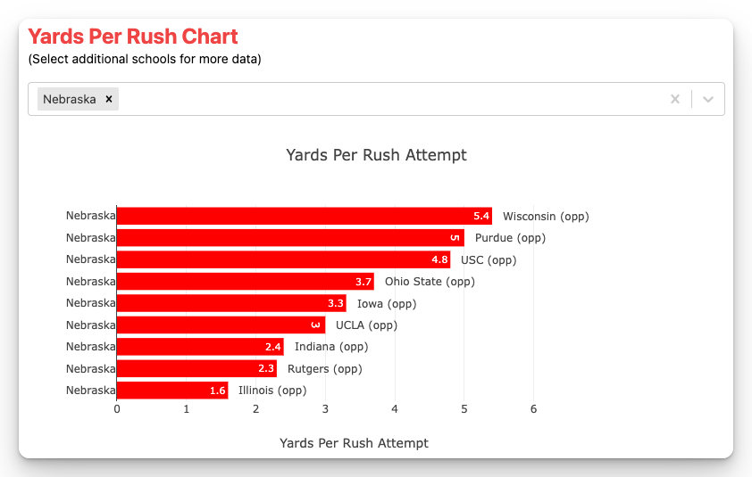
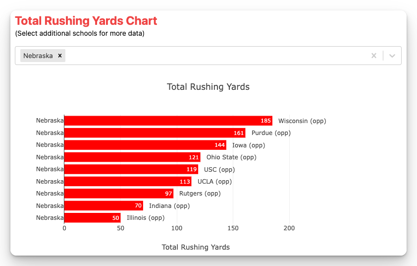
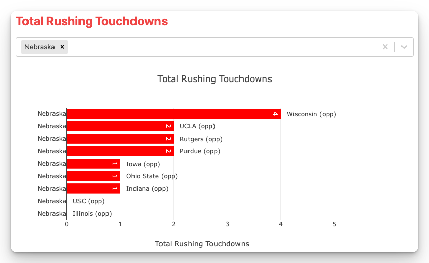

## How did the Huskers rush the ball in 2024 Big Ten play?

The phrase, 'Run The Damn Ball', is as prevelent among Husker fans as it is for any fan base in the country. For many of us, it is because all those years of dominance was lead by an offense that ran the ball with elite skill. Even the quarterbacks during the glory days were better known for their legs then their arms. 

The NFL was a landing spot for many of our running backs and full backs. However, times have changed. The current exception is Ameer Abdullah. The most recent example of an elite talent that still has a place at the next level. 

Matt Rhule voiced his vision for the kind of team he wanted in his initial press conference, which included [being a tough team, that ran the ball and won the line of scrimmage](/matt-rhule-vision-at-introductory-speech).

I don't think anyone believes we will return to a triple option offense. However, we all want to see a team that is tough and dominant. There have been moments of this in the past two years, but there is still ground to gain. 

In 2024, when looking at only the Big Ten games, Nebraska ranked: 

- 12th in yards per rush
- 12th in total yards per game
- 9th in rushing touchdowns per game

Ground to gain, but a vision for what they want to accomplish. Below is a look at the results of the nine Big Ten games for each of those stats. You can look closer by vising the [page for each statistic](/rushing-offense).

