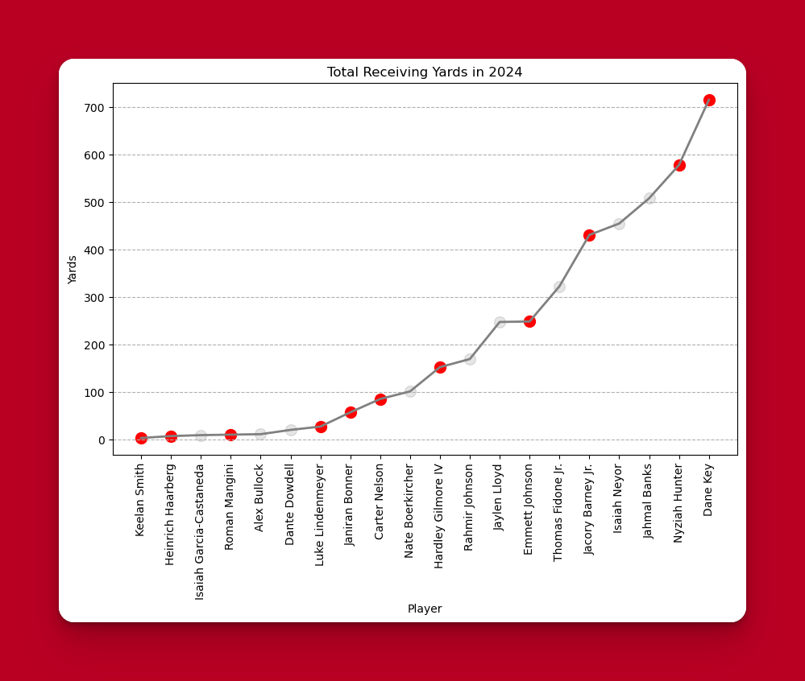
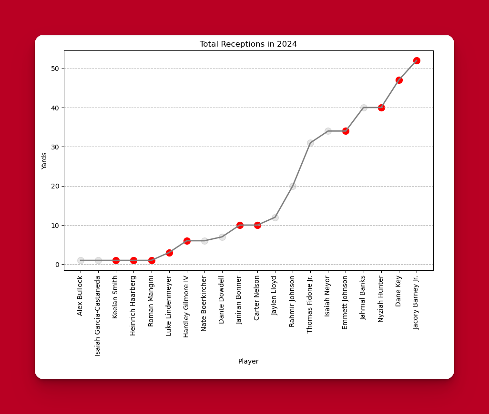
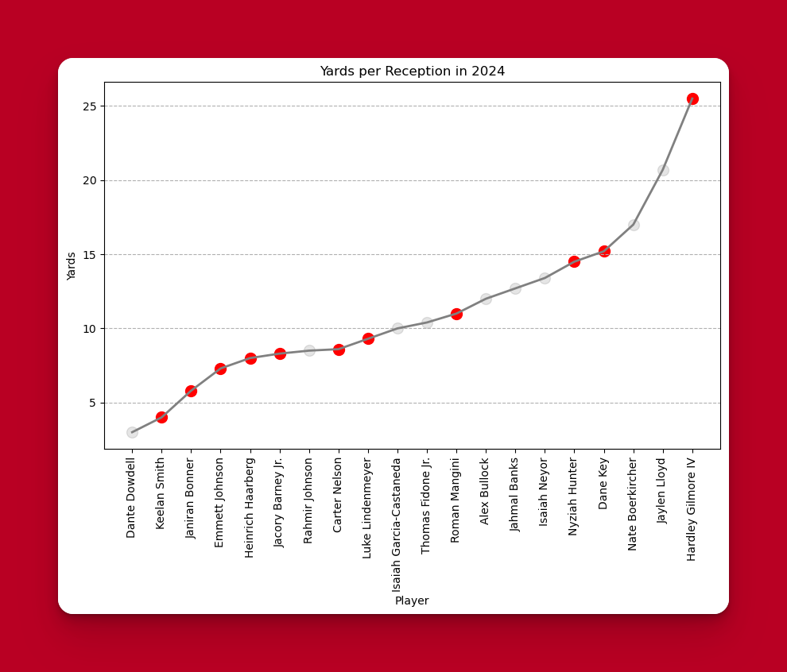
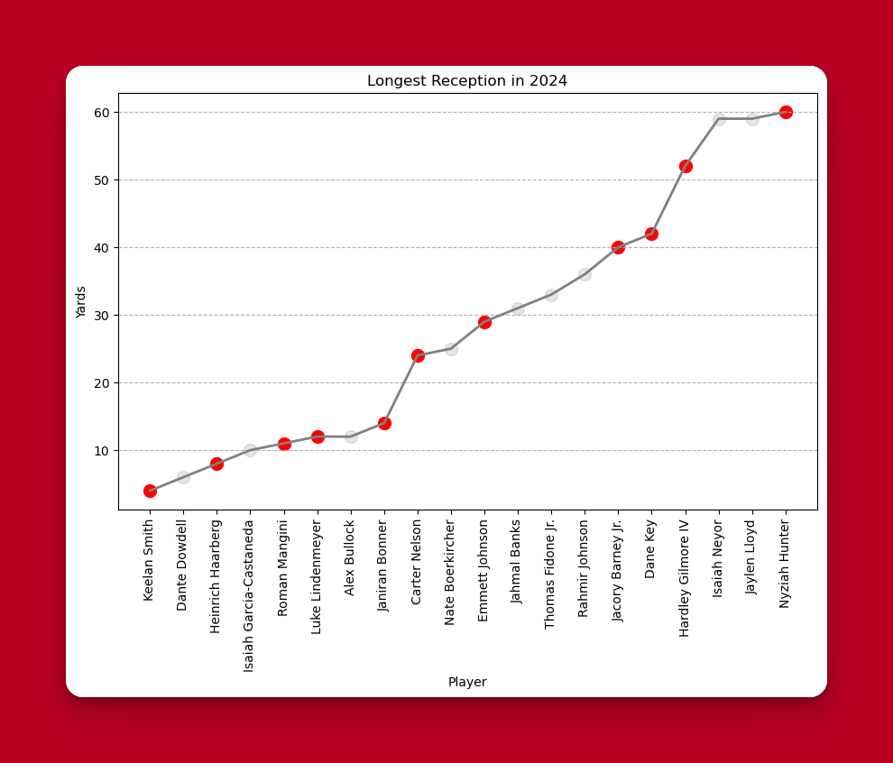
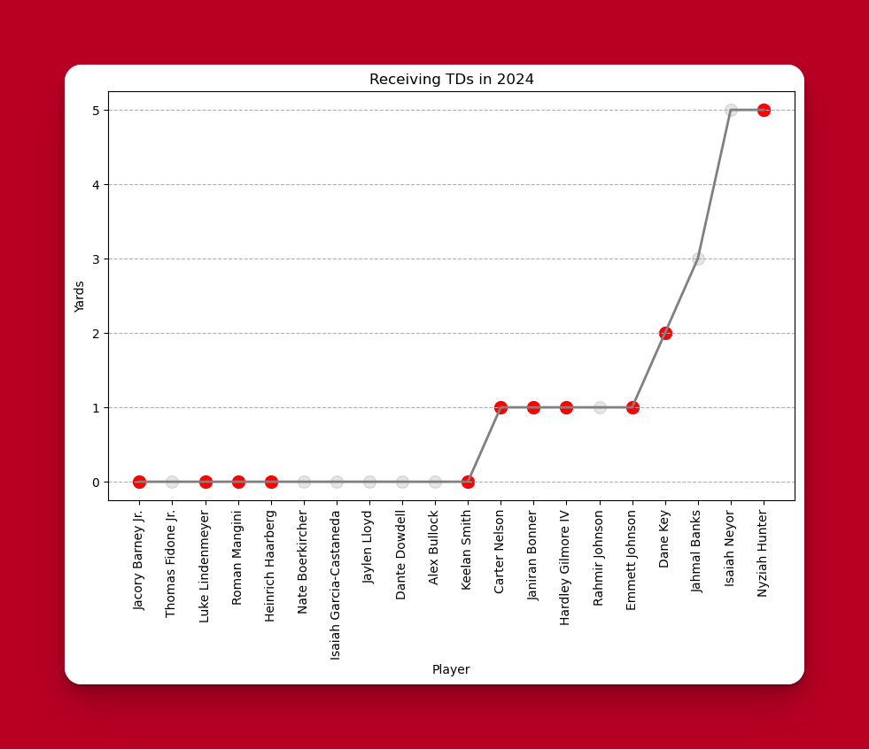
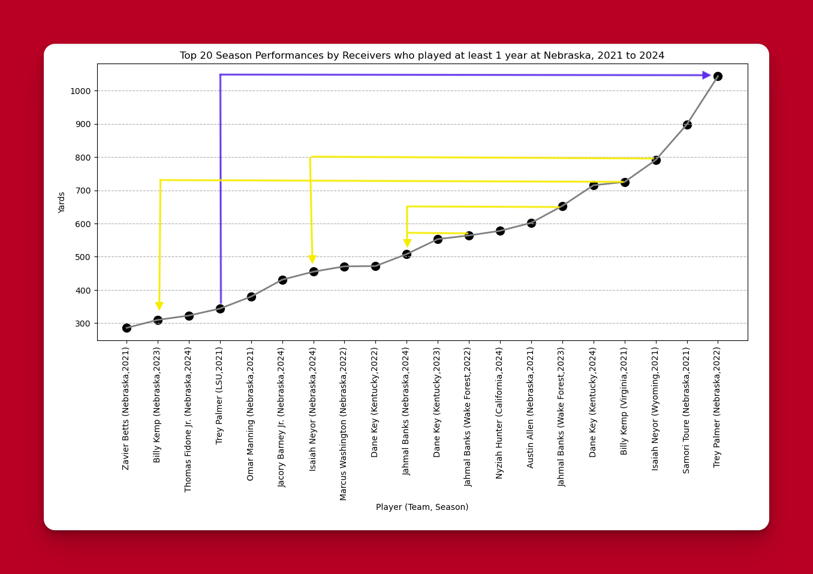

## A deeper look at the coming and going passing offense

Over on Husker Online, there continues to be discussions about the changes at wide receiver. The question continues to be, "Are we sure they are better?". I personally believe they are, but wanted to look at some additional data. 

The following are a look at all the major receiving stats for each player that was at or Nebraska, or will be a Husker next year. The good news is that the leader for every category will be a Husker next year. 

Additionally, when you look at receptions and yards, next years Huskers are looking very strong.

## How much will coaching matter?

The last chart shows the past several years of performances. It reviews that receivers we brought in from the portal actually regressed at Nebraska. Neyor is a little tricky because his good year was at Wyoming, not Texas. But Kemp and Banks both had worse years. The point being, the players coming this year are on par with what we've brought in the past several years when comparing the years they had before they became a Husker.

Trey Palmer the big exception. His only good year was at Nebraska.

This is where the hope lies. I believe that Holgersen and Shorts are significantly better than Satterfield and McGuire. I also believe that they are better than Whipple and Joseph.

Imagine the production if that becomes true.

Note: red circles are players on the team in 2025, grey cicles are players who have moved on.

