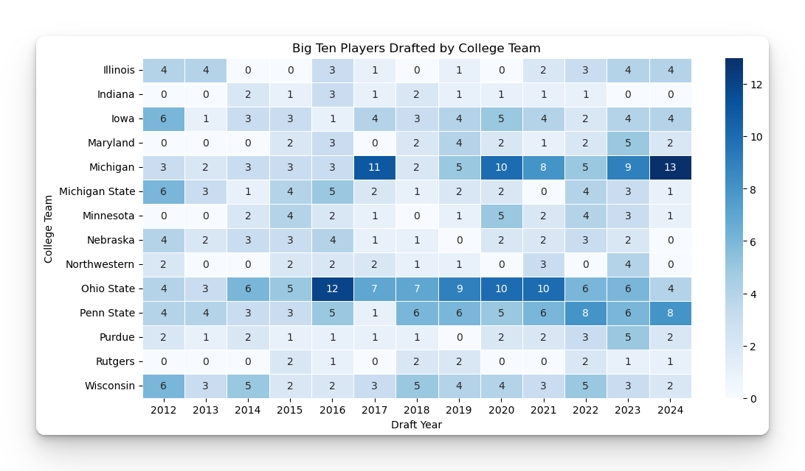

## Do the Huskers put players in the NFL?

As a young boy, growing up in Nebraska during the 1980's and 1990's, I expected our running backs and linemen to end up in the NFL. It was an expectation, because we always had the best running game in college football. Over the past twenty years, perception has changed due to the success the program has had, which had me asking this question: 

"If great college teams have more NFL talent, how many players is Nebraska putting into the league?"

When we look at all time numbers, we stack up well, which I was reminded of when I shared this analysis on Husker Online. However, I wanted to have a more modern review, so I decided to look at all the years since Nebraska has been in the Big Ten. 

This was the result.

It is pretty clear to see that Michigan, Ohio State and Penn State are the best at getting guys an opportunity to play at the next level. 

The question is which way does the causation lead. Do NFL caliber players predict great teams, or do great teams make it easier for NFL teams to take a chance on the players from those rosters. It has to be both, but that is just my intuition. I do not have the data to prove it either way. Maybe I can do an analysis to see how many of the players drafted actually make it in the NFL?

A couple notes about the data set above: 

1. Teams that joined the Big Ten after Nebraksa, such as Maryland and Rutgers are going to have zeros for the years before they joined. I did not care enough about those two schools to fix the data set. 

2. The four Pac 12 schools who joined the Big Ten this year are not included either. 

If you want to look at the players who have been drafted from Nebraska in this timeframe, you can see another view of this heatmap, along with the list of players and stats about their draft outcome on the review page. That page is [HERE](/big-ten-draft-review).

One thing that I am optimistic about, now that coach Rhule is the Huske head coach. He knows what the NFL is looking for in a player, he has been on the other side of the draft table. And... last year after the Huskers did not have a player drafted, he said that it would be the last time that ever happened. 

The 2025 NFL Draft is coming soon, and the experts believe we will have a few more players to cheer for on Sundays next year.