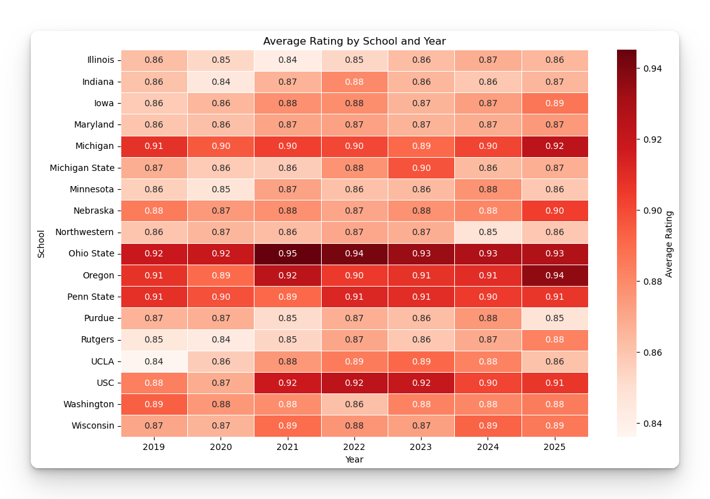

## How well does Nebraska Recruit versus other Big Ten Teams?

In my last post I looked at how many Huskers were getting [selected in the NFL Draft](/blog/nebraska-nfl-draft-review-the-big-ten-years). The hypothesis I was trying to gain insight into was: How many NFL Caliber players does it take to become a good, or even great, college football team. The analysis did not answer that question. There are questions of causation, what defines a great college team, etc. It was a good exploration however. 

It also lead me to ask, how much does recruiting impact team success? 

The obvious answer is that it must matter a lot. A general look at recruiting shows that the best teams also recruit very well. Again, which causes which?

In the current world where recruiting is influenced by salaries being paid (yeah, I know it is NIL, not a salary!), it will be intersting to watch how the top programs and teams continue to compete on the recruiting trail. I have heard that talent is spreading out more than in the past, as players are willing to go to a school that is not Georgia or Alabama, if they are going to make twice as much at a school like Nebraska.

When you look at the following heatmaps, it goes without saying that 2025 is a good year for Nebraska on paper. Maybe it is NIL, or it could be that it is Coach Matt Rhule's second year, and it could also be that Nebraska landed Dylan Raiola who created the momentum. 

Whatever the cause, the numbers say it is the best overall class Nebraska has had since joining the Big Ten.

