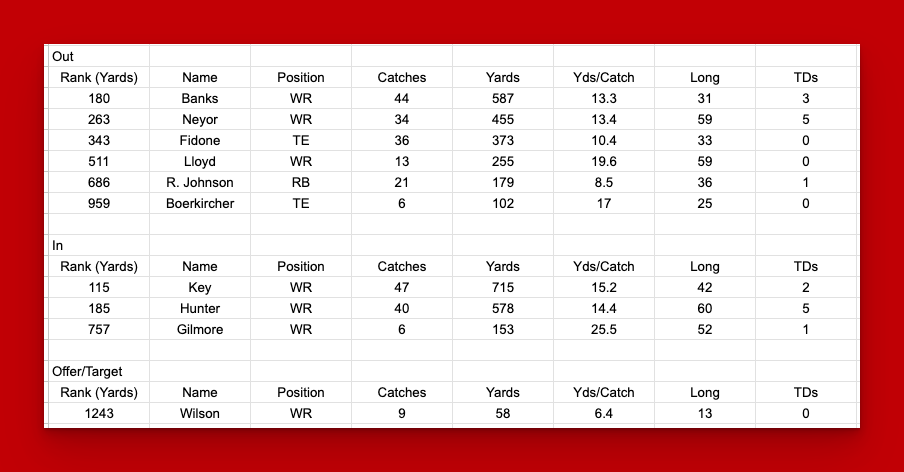
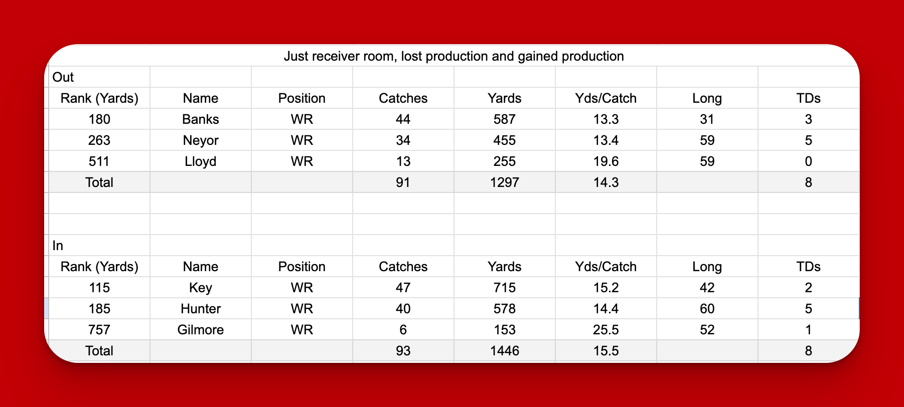
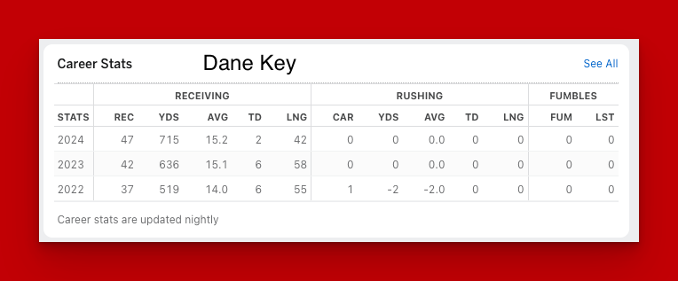
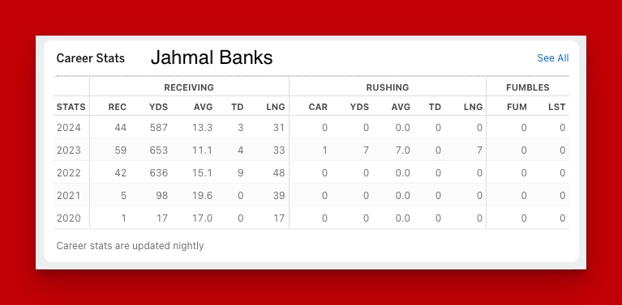

## All receiving stats 

The following is a look at all receiving yards, catches and touchdowns that is leaving the Huskers in 2025. The additions to the 2025 are also on the list. It is now known however that Wilson did not end up at Nebraska. And as we watch the world of college football and the transfer portal, nothing is guaranteed. We continue to see players commit, show up on campus and then transfer out.

That being said, this is the best picture we have on January 19th, 2025.

## Looking at just the lost versus gained production of the receiver room

When we look at just the receiver room and remove tight-ends and running backs, this is what the picture looks like. In terms of total production, it appears that we swapped three players, and the output is very similar. However, I would make the argument that Key and Hunter are of more than equal to combo of Banks and Neyor. 

Why do I say that? That is mostly about where their potential and upside resides. That being said, potential is debateable, from a pure anlysis of production, it looks like a hot swap.

I was (and am) a very big Jaylen Lloyd fan, but I also think that your swapping his potential with Gilmore's potential.

## Nebraska top receiver in terms of production, versus our top incoming production 

The following is a look at Banks (who stepped up for the Huskers towards the end of the season) career versus Key's career. The first thing I will point out is that Banks did not have the season he expected when he came to Nebraska, that I am confident in saying. He took a step backwards in his production, however I am going to place the burden upon the offensive coaching, not on Banks. 

The obvious proof here is coach Rhule bringing in Dana Holgorsen for the last 3 games of the season. 

Even as Banks ends his college career, we get a fourth year receiver in Key, who has improved each year. The touchdowns scored by Key in 2024 is concerning, however as a Husker fan living in Kentucky, I can confidently say that as bad as Nebraska's offensive coaching and game plans were in 2024, Kentucky's were just as poor.

